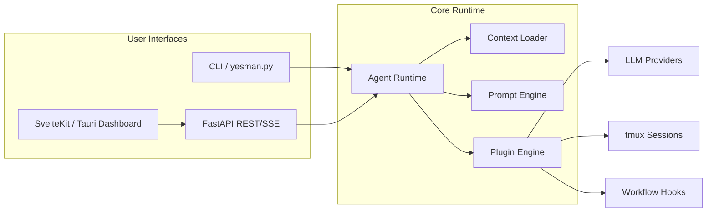

# 🏗 Architecture

## ✔ 전체 구성
- **CLI Runtime**: `yesman.py`가 템플릿, 플러그인, LLM Provider 구성을 로드하여 에이전트를 실행합니다.
- **Agent Runtime**: Prompt Builder, Context Loader, Retry/Recovery, Headless Claude Controller가 핵심 루프를 담당합니다.
- **FastAPI Layer**: REST/SSE/WebSocket API로 상태를 노출하고 Dashboard와 외부 시스템이 구독합니다.
- **Dashboard Layer**: SvelteKit(Web) + Tauri(Desktop)가 동일한 UI 컴포넌트를 공유해 어디서나 동일한 뷰를 제공합니다.
- **Plugin/Workflow Layer**: YAML Workflow, Hook, Plugin Registry가 확장 포인트를 담당합니다.

## 🔄 데이터 흐름 요약
1. **Configuration Load**: `yesman.yaml` → CLI/FastAPI가 공통 설정을 읽고 Runtime에 전달.
2. **Session Provisioning**: 템플릿에 정의된 창/명령을 tmux로 생성하고 Agent Runtime과 연결.
3. **Agent Execution**: Claude Code Headless + Plugin이 Prompt Chain을 처리하며 JSON 로그를 생성.
4. **Streaming & Observability**: FastAPI가 이벤트 스트림을 SSE/WebSocket으로 내보내고 Dashboard가 시각화.
5. **Workflow Completion**: Hook/Plugin이 결과를 파일, 노티피케이션, 외부 API에 기록.

## 🧱 핵심 모듈
- `libs/` : CLI, config, workflow 관련 Python 모듈.
- `api/` : FastAPI 서버, SSE 브로드캐스터, Provider 상태 엔드포인트.
- `tauri-dashboard/` : SvelteKit/Tauri UI, Provider 탐지 로직, 실시간 차트.
- `scripts/` : 설치/운영 스크립트 및 CI 헬퍼.
